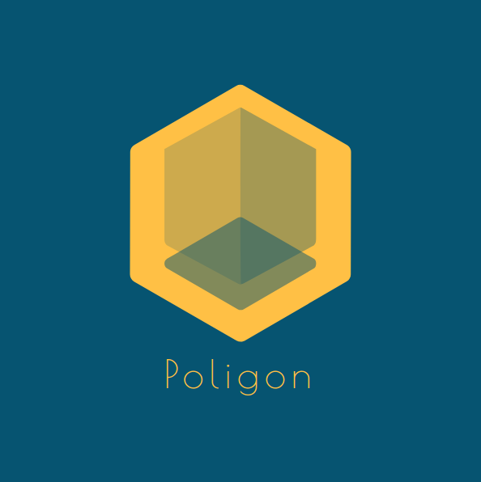
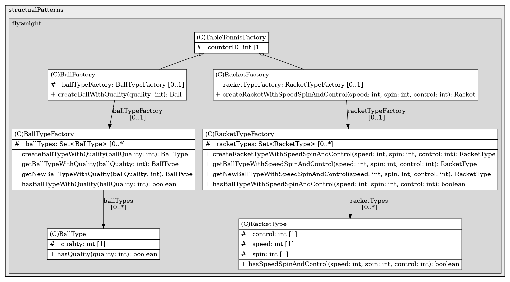

<div id="top"></div>

[![Contributors][contributors-shield]][contributors-url] [![Forks][forks-shield]][forks-url] [![Stargazers][stars-shield]][stars-url] [![Issues][issues-shield]][issues-url] [![MIT License][license-shield]][license-url]


<!-- PROJECT LOGO -->
<br />
<div align="center">
  <a href="https://github.com/dg1asap/Poligon.git">
    
  </a>

  <h3 align="center">Poligon</h3>

  <p align="center">
	Design patterns with unit tests
    <br />
    <a href="https://github.com/dg1asap/Poligon.git">
    <br />
    <br />
    <a href="https://github.com/dg1asap/Poligon/issues">Report Bug</a>
    ·
    <a href="https://github.com/dg1asap/Poligon/issues">Request Feature</a>
  </p>
</div>


<!-- TABLE OF CONTENTS -->
<details>
  <summary>Table of Contents</summary>
  <ol>
    <li>
      <a href="#about-the-project">About The Project</a>
      <ul>
        <li><a href="#built-with">Built With</a></li>
      </ul>
    </li>
    <li>
      <a href="#getting-started">Getting Started</a>
      <ul>
        <li><a href="#prerequisites">Prerequisites</a></li>
        <li><a href="#installation">Installation</a></li>
      </ul>
    </li>
    <li><a href="#implementation">Implementation</a></li>
    <li><a href="#roadmap">Roadmap</a></li>
    <li><a href="#license">License</a></li>
    <li><a href="#contact">Contact</a></li>
    <li><a href="#acknowledgments">Acknowledgments</a></li>
  </ol>
</details>


<!-- ABOUT THE PROJECT -->
## About The Project



The Poligon project was created for two purposes, the first was to support the theory contained in the Design Patterns GoF book with practice. The second was to improve the quality of the unit tests who I wrote in [JUnit5](https://junit.org/junit5/) using the TDD software development technique. In the future, I want to implement some architecture patterns, such as Humble Object and learning mocking using the [Mockito](https://site.mockito.org) framework

<p align="right">(<a href="#top">back to top</a>)</p>


### Built With

* [OpenJDK](https://openjdk.java.net)
* [Gradle](https://gradle.org)
* [JUnit5](https://junit.org/junit5/) 


<p align="right">(<a href="#top">back to top</a>)</p>


<!-- GETTING STARTED -->
## Getting Started

### Prerequisites

Download and install the software below
* [OpenJDK](https://openjdk.java.net/install/)

As an IDE, I use IntelliJ IDEA, which I highly recommend
* [IntelliJ IDEA](https://www.jetbrains.com/idea/download/#section=linux)

### Installation

1. Clone the repo
   ```sh
   git clone https://github.com/dg1asap/Pang.git
   ```
2. Open project using IntelliJ, follow [instruction](https://www.jetbrains.com/help/idea/open-close-and-move-projects.html)
3. The project does not contain any main class, all patterns are checked using unit tests. Using IntelliJ you can easily test a given class by, for example, clicking the green arrow next to its name in the test directory.


<p align="right">(<a href="#top">back to top</a>)</p>


<!-- IMPLEMENTATION -->
## Implementation

For the implementation of construction patterns, I used the example of a maze contained in the book, consisting of rooms, walls and doors. In the case of the others, I tried to independently think up an example situation of using a design pattern. The [refactoring.guru](https://refactoring.guru/design-patterns) website, which I sincerely recommend, also turned out to be very helpful to better understand and implement a design patterns.

<p align="right">(<a href="#top">back to top</a>)</p>

<!-- ROADMAP -->
## Roadmap
- [x] MazeGame
- [x] Creational Patterns
	- [x] Abstract Factory - MazeFactory
	- [x] Builder - MazeBuilder
	- [x] Factory Method - MazeCreator
	- [x] Prototype - MazeFactory
	- [x] Singleton - MazeFactorySingleton
- [x] Structural Patterns
	- [x] Adapter - WizardAdapter
	- [x] Bridge - Color & Shape
	- [x] Composite - Company
	- [x] Decorator - Notifer
	- [x] Flyweight - TableTennis
	- [ ] Proxy - Shop
- [ ] Behavioral Patterns
- [ ] Architecture Patterns
	- [ ] Humble Object


<p align="right">(<a href="#top">back to top</a>)</p>


<!-- LICENSE -->
## License

Distributed under the MIT License. See `LICENSE.txt` for more information.

<p align="right">(<a href="#top">back to top</a>)</p>


<!-- CONTACT -->
## Contact

dg1asap - dg_1@wp.pl

Project Link: [https://github.com/dg1asap/Poligon](https://github.com/dg1asap/Poligon)

<p align="right">(<a href="#top">back to top</a>)</p>


<!-- ACKNOWLEDGMENTS -->
## Acknowledgments

* [refactoring.guru](https://refactoring.guru/design-patterns)
* [Img Shields](https://shields.io)

<p align="right">(<a href="#top">back to top</a>)</p>


<!-- MARKDOWN LINKS & IMAGES -->
<!-- https://www.markdownguide.org/basic-syntax/#reference-style-links -->
[contributors-shield]: https://img.shields.io/github/contributors/dg1asap/Poligon.svg?style=for-the-badge
[contributors-url]: https://github.com/dg1asap/Poligon/graphs/contributors
[forks-shield]: https://img.shields.io/github/forks/dg1asap/Poligon.svg?style=for-the-badge
[forks-url]: https://github.com/dg1asap/Poligon/network/members
[stars-shield]: https://img.shields.io/github/stars/dg1asap/Poligon.svg?style=for-the-badge
[stars-url]: https://github.com/dg1asap/Poligon/stargazers
[issues-shield]: https://img.shields.io/github/issues/dg1asap/Poligon.svg?style=for-the-badge
[issues-url]: https://github.com/dg1asap/Poligon/issues
[license-shield]: https://img.shields.io/github/license/dg1asap/Poligon.svg?style=for-the-badge
[license-url]: https://github.com/dg1asap/Poligon/blob/master/LICENSE.txt
